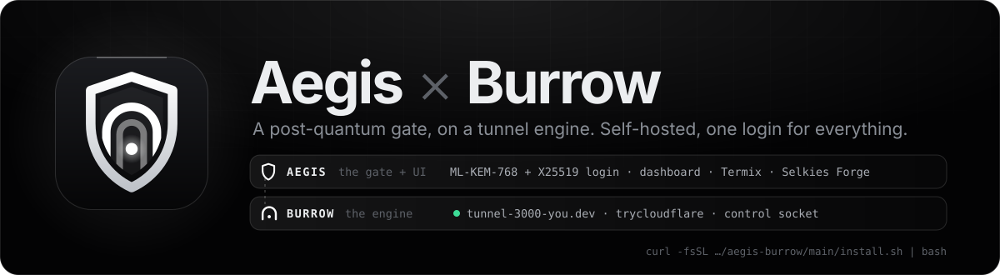
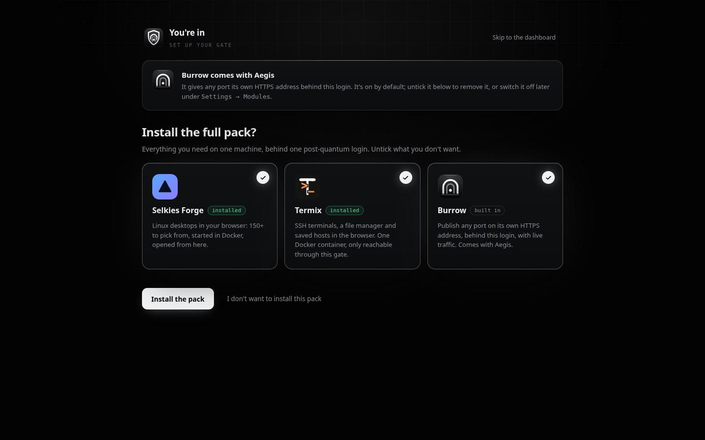
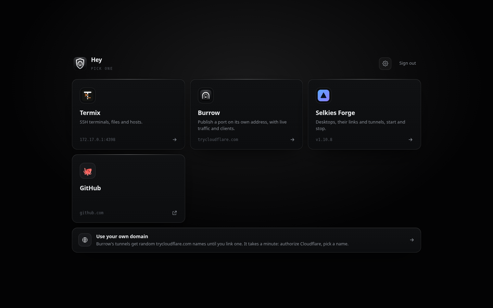
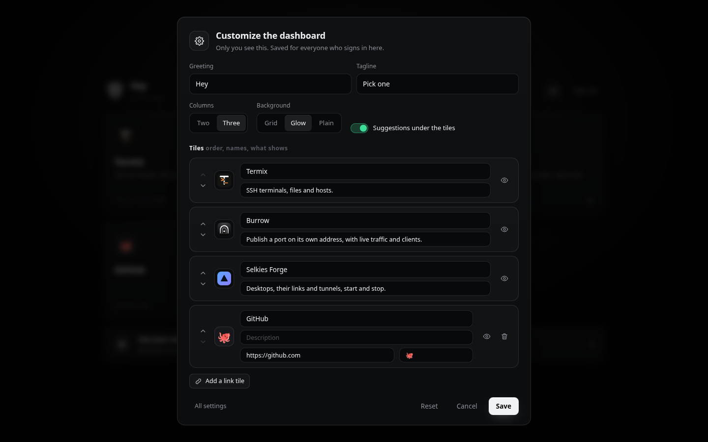
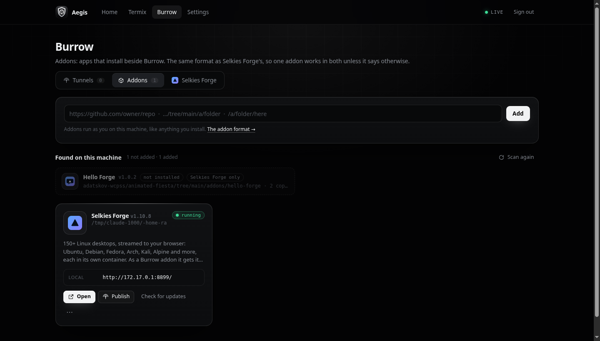
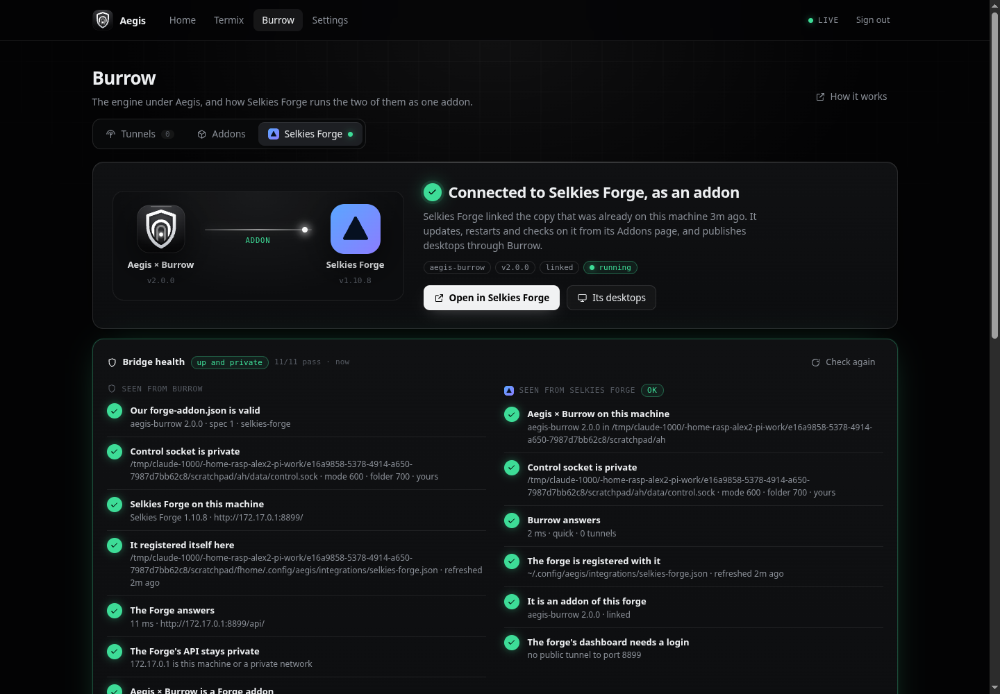

<p align="center">
  
</p>

<p align="center">
  <a href="LICENSE"></a>
  
  
  
  
  <a href="https://github.com/alexd-aero/weft"></a>
</p>

<p align="center">
  <b><a href="#-quick-start">Quick start</a></b> ·
  <b><a href="#-two-halves">Two halves</a></b> ·
  <b><a href="#-burrow-the-engine">Burrow</a></b> ·
  <b><a href="#-addons">Addons</a></b> ·
  <b><a href="#-selkies-forge">Selkies Forge</a></b> ·
  <b><a href="#-the-login">The login</a></b> ·
  <b><a href="#-reference">Reference</a></b>
</p>

---

**Aegis × Burrow** puts one sign-in that nobody, not even Cloudflare, can read in front of everything you run on a machine, and gives any port its own HTTPS address.

- **Aegis** is the gate and the UI: a dashboard you arrange yourself, [Termix](https://github.com/Termix-SSH/Termix) for terminals, [Selkies Forge](https://github.com/adatskov-wcpss/animated-fiesta) for Linux desktops, and your own links.
- **Burrow** is the engine underneath. It runs the tunnels, the Cloudflare link and the addons. Burrow is on by default, and you can switch it off.

Link your own domain with one Cloudflare authorization, or use free `trycloudflare.com` addresses.

```bash
curl -fsSL https://raw.githubusercontent.com/alexd-aero/aegis-burrow/main/install.sh | bash
```

## ⚡ Quick start

<table>
<tr>
<td width="50%" valign="top">

**1 · Install.** The line above finds Node.js 18+ (or downloads a private copy) and `cloudflared` (or downloads it), installs into `~/.local/share/aegis`, and starts a systemd user service.

**2 · Create your login.** The installer prints the one-time setup link twice:

```
  Create your login, from this machine or anywhere:
    local   http://127.0.0.1:4310/__gate/setup
    serveo  https://1a2b3c….serveousercontent.com/__gate/setup
```

The **serveo** link works from any device, with no account and no domain. Pick a username and password; they're sealed with ML-KEM-768 before they leave the page.

**3 · Pick your pack.** Aegis offers Selkies Forge, Termix (with a login you choose right there) and Burrow. Take all of it, some of it, or none.

**Using Selkies Forge?** Open *Burrow → Selkies Forge* and press **Add it for me** (it asks first). Or paste `https://github.com/alexd-aero/aegis-burrow` under the Forge's *Addons* yourself.

</td>
<td width="50%" valign="top">

```bash
# on another port, on your LAN / Tailscale address
./install.sh --port 4310 --bind 100.64.0.5

# is it up, where is it
aegis status
aegis url

# Burrow, the engine
burrow status
burrow publish 3000 --name "my app"
burrow list

# every address it answers on: domain, local, serveo
aegis serveo on | off | url

# the first-run link, Termix, checks
aegis setup-link
aegis termix install
aegis doctor --fix
```

</td>
</tr>
</table>

## 🧩 Two halves

```
 browser ──HTTPS──▶ Cloudflare ──▶ cloudflared ─┐
                                                 ▼
 ┌──────────────────────── Aegis × Burrow ────────────────────────┐
 │  aegis/   the gate: post-quantum login, sessions, every page,   │
 │           the dashboard, Termix proxy, the pack, the bridge     │
 │  ───────────────────────────────────────────────────────────── │
 │  burrow/  the engine: tunnels (tunnel-PORT-you.dev or quick),   │
 │           Cloudflare link, traffic stats, addons, control.sock  │
 └────────────────────────────────────────────────────────────────┘
        ▲ data/control.sock (600)              ▲ ~/.config/aegis/integrations/
        └── Selkies Forge, the burrow CLI      └── apps plug in here
```

**Burrow has no login of its own.** Aegis decides who reaches a tunnel: login-protected unless you make it public. In the code it is two folders, `aegis/` and `burrow/`, and one process.

## 🎁 The first run

<p align="center"></p>

Right after you create your login:

- **Burrow comes with Aegis.** It's on by default. Untick it here, or switch it off later under *Settings → Modules*. Your tunnels are kept while it's off.
- **Install the full pack?** Three cards, all ticked:

  | | |
  |---|---|
  | **Selkies Forge** | 150+ Linux desktops in the browser. Its installer runs unattended, and it becomes a Burrow addon. |
  | **Termix** | SSH terminals, files and saved hosts. One Docker container bound to `127.0.0.1`. You choose **its own username and password** on the same page, sealed on the way like your login, and that account becomes Termix's admin. |
  | **Burrow** | The engine, on. |

  Or press **I don't want to install this pack**. *Settings → Modules → Open the pack* brings this page back.

## 🎛️ Your dashboard

<p align="center"> </p>

The **gear** on the home page opens *Customize the dashboard*:

- greeting and tagline;
- two or three columns;
- background (grid, glow or plain);
- every tile moved, renamed, re-described or hidden;
- link tiles of your own, with an emoji or an image;
- suggestions on or off;
- **Reset**.

Everything else lives in **Settings**:

| Section | What you can change |
|---|---|
| **Sign-in** | The gate's name, the line on the sign-in page, how long a sign-in lasts, the lockout after wrong tries |
| **Modules** | Burrow on or off; the **serveo link** on or off (with its address); the pack |
| **Domain** | Link a domain through Cloudflare, or unlink it |
| **Termix** | Install, open, remove (its data volume is kept) |
| **Login** | Your username and password |
| **Connected apps** | Apps that plugged in |

## 🕳️ Burrow, the engine

**Burrow → Tunnels** publishes any port at its own HTTPS address: `tunnel-3000-aegis.example.com` with a linked domain, or a random `trycloudflare.com` name without one. Every tunnel shows:

- live requests and bandwidth;
- latency percentiles and status codes;
- its clients, with kick, block and pause.

Each tunnel is login-protected unless you make it public.

The engine also answers on **`data/control.sock`**, a Unix socket only your user can open. That is how [Selkies Forge](#-selkies-forge) and the `burrow` command work without a browser:

```bash
burrow status                       # Burrow 2.0.0: on, 3 tunnels (3 live), tunnel-PORT on alexaero.dev
burrow list
burrow publish 8790 --name hello    # login-protected; --public for anyone
burrow unpublish 8790
burrow off / on                     # the module switch (tunnels are kept)
```

**Your own domain:** *Settings → Domain → Connect Cloudflare* shows Cloudflare's own authorization link. Pick your zone and a name (default `aegis`). Burrow then:

1. creates a named tunnel;
2. adds a proxied CNAME for `aegis.<zone>`;
3. runs `cloudflared --post-quantum` itself.

Each tunnel gets its own DNS record. *Unlink* removes the records, the tunnel and the files.

## 🔗 The serveo link

Aegis × Burrow opens `ssh -R 80:localhost:PORT serveo.net` itself and keeps it up. That gives the dashboard a public `https://…serveousercontent.com` address, from a key of its own in `data/serveo/` so the name stays the same.

- **When it's on.** By default until a domain is linked, so a first run is reachable from your phone. After that it's off, unless you switch it on in *Settings → Modules* or with `aegis serveo on`.
- **It goes through the same gate as everything else.** Serveo's visitors count as remote, never as "this machine", even though serveo connects from loopback. The setup page needs the one-time token, sign-in needs your password, and the lockout counts each visitor's real address.
- **Serveo's warning page.** Serveo shows its own *Browser Warning* the first time a browser opens a free tunnel; press *Continue to Site*.

## 📦 Addons

<p align="center"></p>

**Burrow → Addons** installs apps beside Burrow. **Everything is powered by the [Weft Architecture](https://github.com/alexd-aero/weft)**: the same addon format as Selkies Forge, a `forge-addon.json` and a few bash scripts, read with the same rules, run with the same environment, and talking back with the same `::progress`, `::open` and `::warn` lines. One addon works in both unless its manifest says otherwise:

```json
"platforms": ["selkies-forge", "burrow"]    // the default; name one to stay on that host
```

- **Paste a link.** Any of these works:
  - a repository on GitHub, GitLab (subgroups and self-hosted too), Codeberg, or any git URL;
  - a folder in one (`…/tree/main/a/folder`, GitLab's `…/-/tree/…`, or a `/blob/` link to its `forge-addon.json`);
  - a **`.zip` / `.tar.gz` download**, inspected statically first: unpacked into a fresh folder with size limits, refused if anything could escape it, then its manifest validated before anything runs;
  - a folder on this machine. The addon shows up as a card. Install it, open it, run its actions, check for updates against its git commits, and uninstall it. An addon whose status reports a port gets **Publish**, which gives it a Burrow address.
- **Found on this machine.** Opening *Addons* scans your home, `/opt`, `/srv` and the code folders apps declare. It lists every valid addon it finds, **running, stopped or not installed**, using each one's read-only `detect` and `status` scripts. Addons already in the list aren't repeated. Addons made for another host are shown greyed out.

Scripts get the universal `ADDON_*` names (`ADDON_ID`, `ADDON_DIR`, `ADDON_DATA`, `ADDON_SETTING_<KEY>`, `ADDON_HOST=burrow`…), the older `FORGE_ADDON_*` twins, and `BURROW_SOCKET`. **Start here:** [the Weft Architecture](https://github.com/alexd-aero/weft). It has the spec, **[stable example addons that link to each other](https://github.com/alexd-aero/weft#-the-examples)** (Beacon, Pulse, Relay for Burrow, Shelf for the Forge), `weft-check`, `weft-run`, and [a strict brief for AI agents](https://github.com/alexd-aero/weft/blob/main/prompt.md). The Forge's [addon guide](https://github.com/adatskov-wcpss/animated-fiesta/blob/main/docs/addons.md) covers the details.

## 🖥️ Selkies Forge

<p align="center"></p>

Aegis × Burrow and Selkies Forge each become **the other's addon**, and either side can start it:

| From | Do | Then |
|---|---|---|
| **Selkies Forge** | *Addons* → paste this repository (or *Add and link* under *Found on this machine*) | The Forge links the copy that's already here. Burrow sees it and adds the Forge as one of its own addons, from the Forge's checkout. |
| **Burrow** | *Burrow → Selkies Forge → **Add it for me*** | Burrow first lists exactly what it will do and waits for **Allow**. Then it checks its own `forge-addon.json` with the Forge's rules, the Forge adds and links it (with its live log shown in Burrow), and Burrow adds the Forge. Prefer to do it yourself? **I'll do it myself** shows the link and the button to press |
| **Burrow** | *Burrow → Addons* → *Add and link* on Selkies Forge | The same, from the other end. |

Once linked:

- **The Forge** lists Aegis × Burrow among its addons.
- **Burrow** lists the Forge among its own, with its desktops, their links, start/stop/restart and one-click **Publish**.
- **The Forge's Open desktop** button offers each desktop's Burrow address.

The **Selkies Forge** tab shows:

- which version and commit the Forge installed, and whether it linked it;
- whether an update waits, with **Update in Selkies Forge**;
- what the Forge can run: lifecycle scripts, actions and settings;
- every call it made on the control socket.

**Bridge health**, on both sides, says whether the link is **up and private**:

| Check | Why it can fail |
|---|---|
| Control socket is private | Missing, not a socket, not yours, not mode `600`, or in a folder others can enter |
| Both sides answer | The socket or the Forge's API doesn't respond |
| The Forge registered itself | Its drop-in is stale, or writable by anyone but you |
| Each side has the other as an addon | One side hasn't added the other yet; **Add it** fixes it (after asking) |
| The Forge's API stays private | It answers on an address that isn't loopback, a private network or Tailscale |
| The Forge's dashboard needs a login | Warns when a Burrow tunnel publishes it to anyone |
| Our manifest is valid, and versions fit | The checks *Add it for me* relies on |

Burrow's tab shows both views side by side: *Seen from Burrow* and *Seen from Selkies Forge*. The Forge shows its own at the top of *Addons*.

Any other app can plug in the same way. It drops `~/.config/aegis/integrations/<id>.json` with `{spec, id, kind, name, version, url, port, logo}`, and Aegis reads the folder on every request.

## 🔐 The login

```
ss       = X-Wing shared secret       (ML-KEM-768 + X25519; the server key pair is single-use)
K_inner  = HKDF-SHA384(ss, salt = challenge id, "aegis/v1/inner")
K_outer  = HKDF-SHA384(ss, salt = challenge id, "aegis/v1/outer")
payload  = AES-256-GCM(K_outer, AES-256-GCM(K_inner, {username, password}))
```

- **Sealing in the browser.** It is pure JavaScript ([noble](https://paulmillr.com/noble/)), so it works on LAN and Tailscale addresses where browsers hide `crypto.subtle`. The pack's Termix password and password changes are sealed the same way.
- **Passwords** are stored as scrypt (N=2¹⁵), with a configurable lockout.
- **Sessions** are AES-256-GCM sealed tokens bound to their host. **One login per browser:** login-protected tunnels sign in through the dashboard with single-use 60-second tickets.
- **TLS.** With `tls` set, the server speaks TLS 1.3 with X25519MLKEM768 and AES-256-GCM only.

## 📖 Reference

<details>
<summary><b><code>aegis</code> and <code>burrow</code> commands</b></summary>

| Command | What it does |
|---|---|
| `aegis install [--port N] [--bind ADDR] [--home DIR] [--termix] [--no-start]` | Install, or upgrade in place (keeps the login, settings, tunnels and addons) |
| `aegis upgrade` | Copy this checkout's code over the installed one and restart |
| `aegis uninstall [--purge]` | Stop and remove; `--purge` also deletes the login, tunnels and Cloudflare credentials |
| `aegis start` · `stop` · `restart` · `status [--json]` · `url` · `setup-link` · `logs [-f]` | The usual |
| `aegis termix install` · `remove` | Termix in Docker, behind the gate |
| `aegis doctor [--fix]` | Check (and fetch) Node.js and cloudflared; check Docker |
| `aegis burrow …` = `burrow …` | `status` · `list` · `on` · `off` · `publish PORT [--name N] [--public] [--host H]` · `unpublish PORT` |

</details>

<details>
<summary><b>Files and settings</b></summary>

```
aegis/                           the gate and the UI (server.mjs is the entry point)
burrow/                          the engine: index.mjs, tunnels.mjs, cloudflare.mjs, addons.mjs
public/                          the pages
forge-addon.json  forge/         how Selkies Forge installs, links and runs it

~/.local/share/aegis/            AEGIS_HOME
  app/  node/  bin/              the code; private Node and cloudflared when the machine had none
  config.json                    written once by the installer (listen, tls, cookie…), never by the server
  secret.key                     seals the session cookies
  data/state.json                everything you change in the UI
  data/tunnels.json  metrics.json  favicons/  revoked.json  cf/  control.sock  addons.json
  data/addons/<id>/repo  data/addons/<id>/data     Burrow's addons
~/.config/aegis/aegis.json       where all that is (Selkies Forge reads it)
~/.config/aegis/integrations/    where other apps plug in
```

| `config.json` key | Default | |
|---|---|---|
| `listen` | `{"host": "127.0.0.1", "port": 4310}` | `AEGIS_BIND` / `AEGIS_PORT` override it |
| `tls` | `null` | `{"key", "cert"}` to serve HTTPS |
| `cookie` | `"__Host-aegis"` | The session cookie over HTTPS |
| `extraHosts` | `[]` | More names that reach the dashboard |
| `termix` | `null` | `{"upstream": "https://127.0.0.1:4300"}` to use a Termix you already run |
| `domain` | `null` | `{"mainHost", "tunnelId", "cert", "managed": false}` for a tunnel you run yourself |

A deep `AEGIS_HOME` whose socket path would be over 100 bytes gets the socket in `$XDG_RUNTIME_DIR/burrow-<uid>/`, and `data/control.sock` links to it. The discovery file's `service.scope` can be `user`, `system` (a unit someone wrote by hand; installs point its `ExecStart` at the new code) or `manual` (something else supervises it, and installs never touch services).

</details>

<details>
<summary><b>HTTP API</b> (signed in; changes need <code>X-Gate: 1</code> and a same-origin request)</summary>

| | |
|---|---|
| `GET /__gate/health` | `{ok, app: "aegis-burrow", version, burrow}`, no login needed |
| `GET /__gate/api/me` | Everything the pages need |
| `POST /__gate/api/prefs` | Title, home layout, sign-in settings, `modules: {burrow}` |
| `GET` · `POST /__gate/api/pack` | The pack |
| `/__gate/api/tunnels…`, `/ports` | Burrow's tunnel API (409 while it is off) |
| `GET /__gate/api/addons` · `/addons/scan[?fresh=1]` · `POST /addons/add {source}` | Addons, and what the scan found |
| `POST /__gate/api/addons/<id>/install` `{settings}` · `update` · `uninstall` `{keep_data}` · `remove` · `action` `{action}` · `check` · `share` `{on, access}` | The lifecycle; jobs at `GET /addons/jobs/<id>?since=N`, `POST …/cancel` |
| `GET /__gate/api/addon` · `/bridge` · `POST /bridge/connect` · `GET /bridge/job/<id>?since=N` | As a Selkies Forge addon; the bridge's health; *Add it for me*; the Forge's job, live |
| `POST /__gate/api/addons/inspect` `{source}` | Fetch and validate a link (git, GitLab, .zip, .tar.gz) without adding it or running anything |
| `/__gate/api/cf…`, `/termix…`, `/integrations…`, `/password` | Domain, Termix, connected apps, the login |

The control socket serves the tunnel API (without `/__gate/api`), plus `GET /status` and `POST /module {burrow}`. Callers name themselves with `X-Burrow-Client: name/version`.

</details>

<details>
<summary><b>Building and testing</b></summary>

The repository ships `public/login.js` and `aegis/vendor/pq.mjs` built, so installs never run npm. After changing `client/` or upgrading noble: `npm install && npm run build`. `npm run check` syntax-checks everything; `npm test` runs the addon host's tests (the same cases as Selkies Forge's).

</details>

## 🌱 Where it came from

Aegis and Burrow started as two repositories: a gate, and a tunnel manager with its own copy of the same login. Here they are one product, with Aegis on top and Burrow underneath. If you ran either, `aegis install` upgrades it in place and keeps your login, domain and tunnels. Selkies Forge lists it under *Found on this machine*, ready to link.

## 🙏 Credits

- **Powered by the [Weft Architecture](https://github.com/alexd-aero/weft)**, the addon format it shares with [Selkies Forge](https://github.com/adatskov-wcpss/animated-fiesta)
- [Cloudflare](https://www.cloudflare.com/) tunnels, [noble](https://paulmillr.com/noble/) for the post-quantum cryptography, [Termix](https://github.com/Termix-SSH/Termix) for terminals

## 💙 It's yours

> [!IMPORTANT]
> **Aegis × Burrow is open source under the [MIT licence](LICENSE).** Use it, change it, fork it, rename it, ship it. You don't need to ask anyone.

<p align="center"><sub>Grew out of a Raspberry Pi's private gate. MIT licensed. Make it yours.</sub></p>
